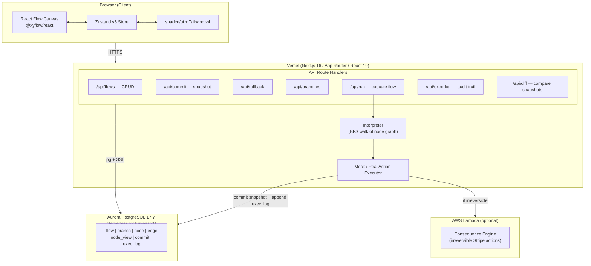
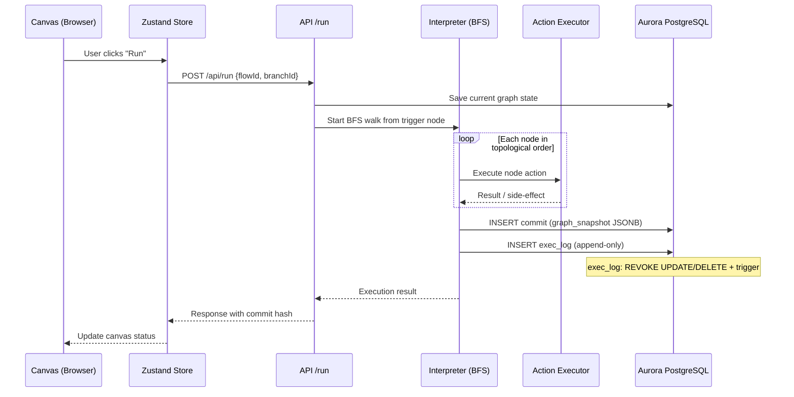
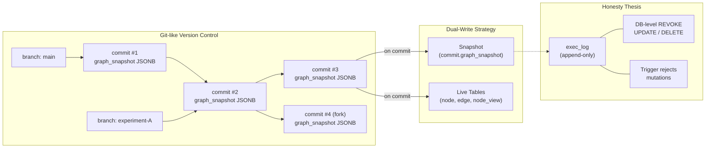
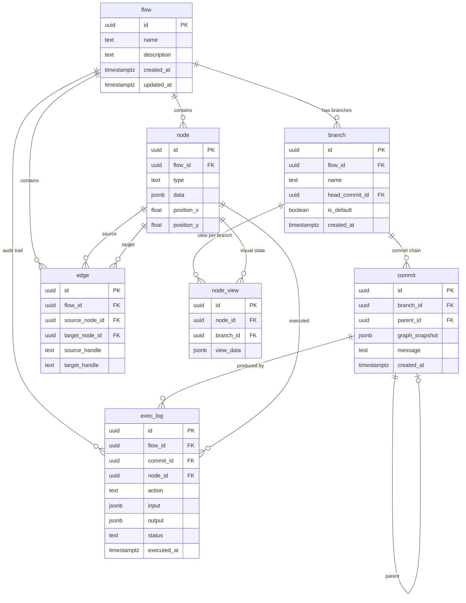

# H0 Visual Automation Builder — Architecture

## System Architecture

## Run Execution Flow

## Version Control Model

## Database Schema (ER Diagram)

---

**Key architectural decisions:**

- **Append-only exec_log** enforces the honesty thesis at the database level — no UPDATE or DELETE is permitted (enforced via PostgreSQL REVOKE and a reject-mutation trigger).
- **Dual-write on commit** stores both a self-contained JSONB snapshot (for instant rollback/diff) and updates live tables (for fast querying and canvas rendering).
- **BFS interpreter** walks the directed graph from trigger nodes, enabling deterministic replay and step-by-step debugging.
- **Branch model** mirrors git: cheap branching for experimentation, with a head pointer per branch referencing the latest commit.
